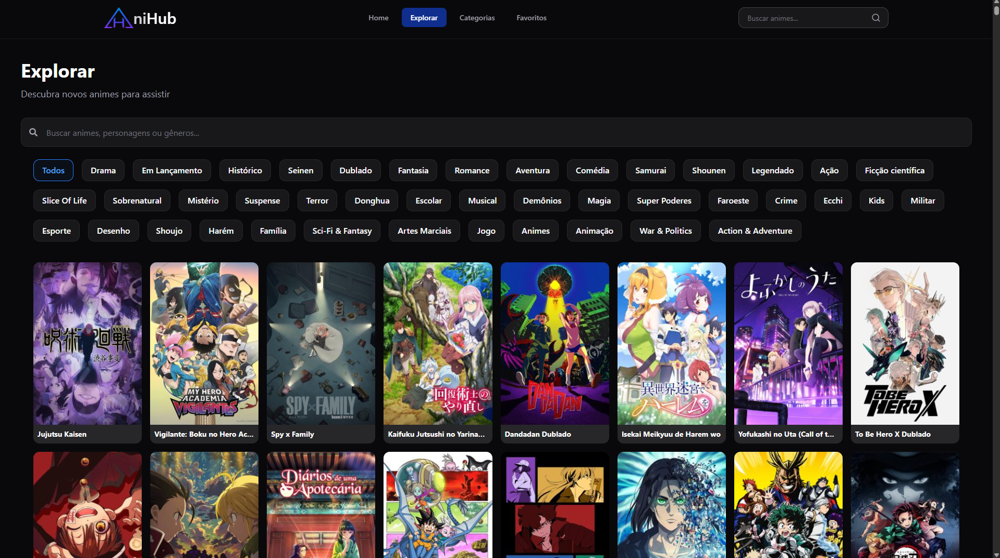
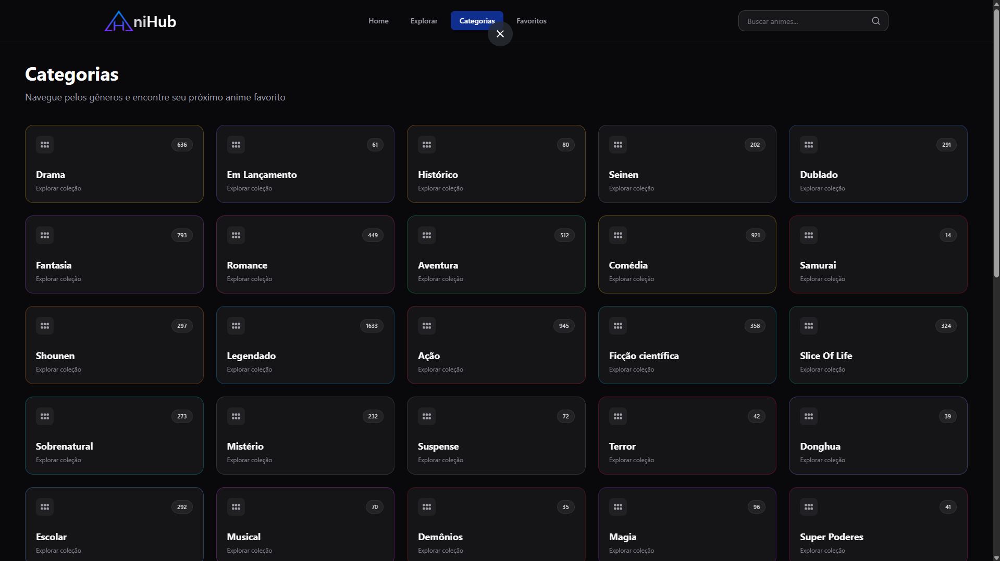
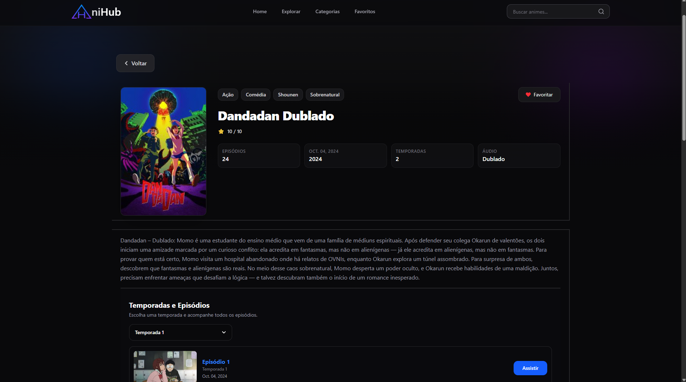
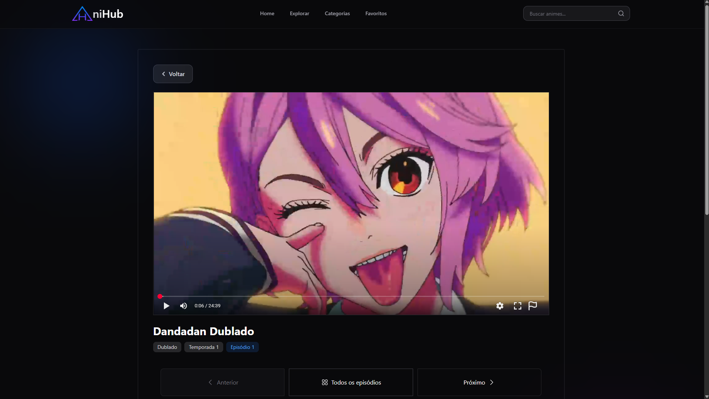

# AniHub

AniHub é um projeto de front-end desenvolvido com **React** e **Tailwind CSS**, inspirado nas principais plataformas de streaming de animes. O projeto foi criado com o objetivo de aprofundar conhecimentos em desenvolvimento web moderno, componentização, consumo de dados, gerenciamento de estado e construção de interfaces profissionais.

> Projeto em desenvolvimento contínuo.

---

# Preview

|         Home         |         Explorar         |
| :------------------: | :----------------------: |
|  |  |

|         Gêneros         |    Página do Anime    |
| :---------------------: | :-------------------: |
|  |  |

|        Player         |
| :-------------------: |
|  |

---

# ✨ Funcionalidades

- Página dedicada para assistir animes principalmente antigos.
- Sistema de busca de animes.
- Sistema visual de favoritos.
- Catálogo organizado por gêneros.
- Página individual para cada anime.
- Informações de temporadas e episódios.
- Layout totalmente responsivo.
- Interface moderna em tema escuro.
- Componentes reutilizáveis.
- Design inspirado em plataformas como Netflix e Crunchyroll.

---

# Tecnologias

- React
- JavaScript (ES6+)
- Tailwind CSS
- React Router DOM
- React Icons
- Vite

---

# Objetivos do Projeto

Este projeto foi desenvolvido para praticar:

- Componentização no React.
- Organização de projetos escaláveis.
- Boas práticas de Front-end.
- Criação de interfaces modernas.
- Gerenciamento de estados.
- Navegação entre páginas.
- Responsividade.
- Organização de código.

---

# ⚠️ Aviso

Este projeto possui fins exclusivamente educacionais e de portfólio.

O AniHub **não hospeda nenhum vídeo** em seus servidores. Todo o conteúdo exibido é fornecido por serviços de terceiros, utilizados apenas para demonstração da interface.

---

# 👨‍💻 Desenvolvedor

**João Paulo**

GitHub:
https://github.com/jaozinpaulin

---

## ⭐ Status do Projeto

🚀 Em desenvolvimento constante, com novas funcionalidades sendo adicionadas continuamente.
