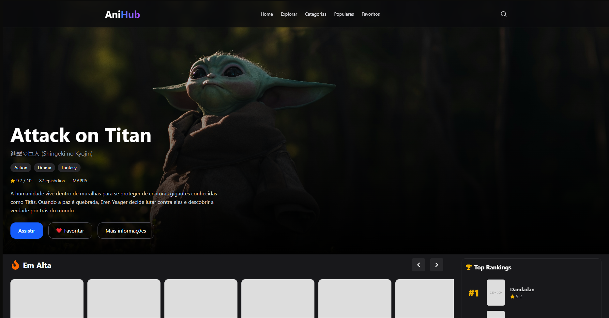
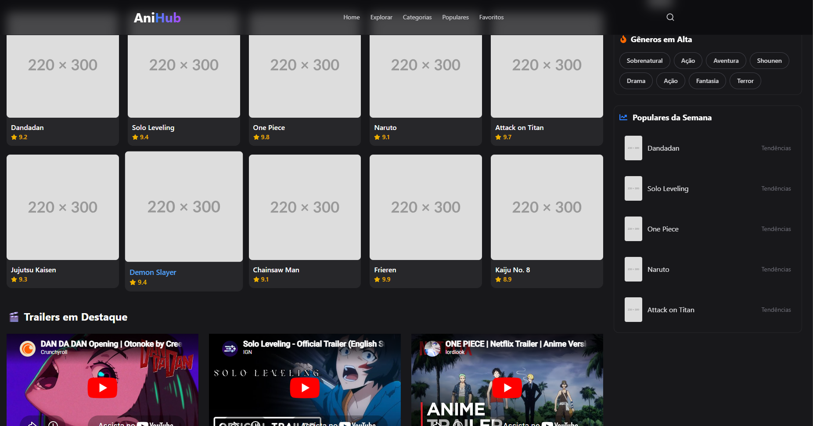

#  AniHub

AniHub é um projeto pessoal de front-end desenvolvido com React e Tailwind CSS, com foco em prática de componentização, criação de interfaces modernas e simulação de uma plataforma de streaming de animes.

---

##  Demonstração

> Projeto em desenvolvimento contínuo (v0.1)

---

##  Preview

---

##  Sobre o projeto

O AniHub simula uma plataforma de descoberta de animes, com trailers, listas e seções organizadas em um layout inspirado em serviços de streaming como Netflix e Crunchyroll.

O objetivo principal é praticar:

- Componentização no React
- Organização de projeto front-end
- Uso de Tailwind CSS
- Estrutura de dados simulados (API fake)
- Criação de UI moderna e responsiva

---

##  Tecnologias utilizadas

- React
- JavaScript (ES6+)
- Tailwind CSS
- React Icons

---

##  Funcionalidades

- Lista de trailers com embed do YouTube
- Componentes reutilizáveis
- Header com navegação
- Sistema visual de favoritos (UI)
- Barra de busca interativa
- Layout responsivo
- Interface dark moderna
