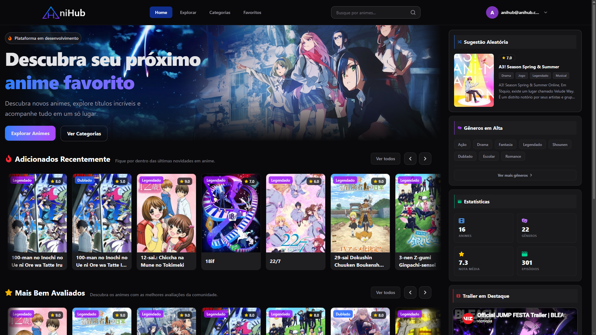
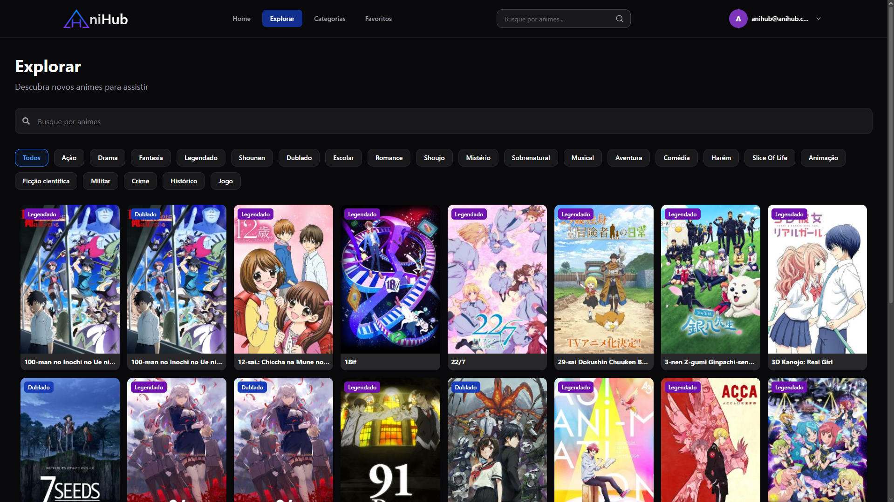
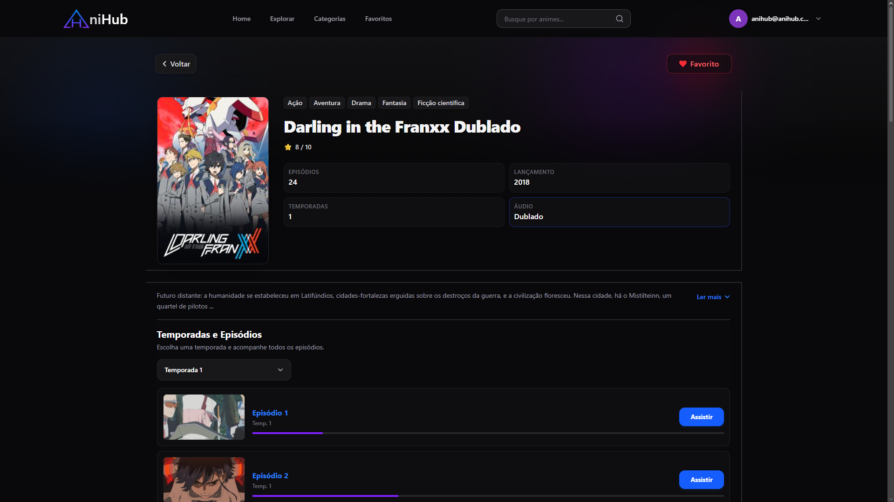
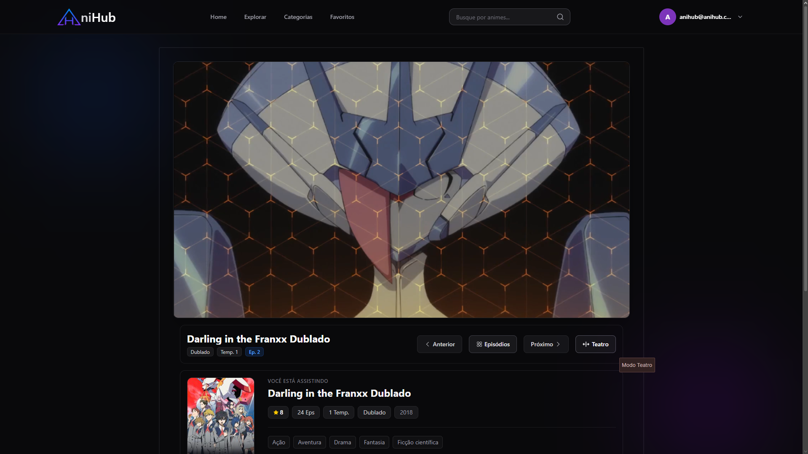

# AniHub

AniHub é uma aplicação web desenvolvida com **React**, **Firebase** e **Tailwind CSS**, inspirada nas principais plataformas de streaming de animes.

O projeto foi criado com foco em aprendizado e evolução como desenvolvedor Front-end, aplicando conceitos modernos de desenvolvimento, consumo de dados, autenticação, gerenciamento de estado, componentização e otimização de performance.

> Projeto desenvolvido para fins de estudo e portfólio.

---

# Preview

|          Home          |          Explorar          |
| :--------------------: | :------------------------: |
|  |  |

|     Página do Anime     |         Player          |
| :---------------------: | :---------------------: |
|  |  |

---

# Funcionalidades

- Busca de animes em tempo real.
- Sistema de favoritos sincronizado com Firebase.
- Autenticação de usuários.
- Página individual para cada anime.
- Player integrado.
- Catálogo organizado por gêneros.
- Lista de animes populares.
- Sistema de progresso dos episódios.
- Continuação automática do progresso salvo do usuário.
- Carregamento otimizado utilizando paginação e lazy loading.
- Interface totalmente responsiva.
- Tema escuro moderno.
- Componentes reutilizáveis.
- Design inspirado em plataformas como Netflix e Crunchyroll.

---

# Tecnologias

- React
- JavaScript (ES6+)
- Vite
- Tailwind CSS
- Firebase Authentication
- Cloud Firestore
- React Router DOM
- React Icons

---

# Conceitos Aplicados

Durante o desenvolvimento foram utilizados diversos conceitos importantes do ecossistema React:

- Componentização
- Hooks (useState, useEffect, useMemo, useRef e Context API)
- Gerenciamento de estado global
- Rotas protegidas
- Consumo de dados
- Persistência de informações no Firebase
- Organização de projetos escaláveis
- Lazy Loading
- Paginação de dados
- Responsividade
- Boas práticas de código

---

# Objetivo

O AniHub foi desenvolvido para consolidar conhecimentos em desenvolvimento Front-end moderno, simulando funcionalidades presentes em plataformas reais de streaming de animes.

Além de servir como projeto de portfólio, o sistema permitiu praticar integração com Firebase, autenticação, banco de dados em tempo real, otimização de consultas e construção de interfaces modernas.

---

# ⚠️ Aviso

Este projeto possui finalidade exclusivamente educacional e de portfólio.

O AniHub **não hospeda nenhum vídeo** em seus servidores.

Todo o conteúdo exibido é incorporado por serviços de terceiros e utilizado apenas para demonstração da aplicação.

---

# Desenvolvedor

**João Paulo da Silva Soares**

GitHub:
https://github.com/jaozinpaulin

LinkedIn:
https://www.linkedin.com/in/joaopaulodasilvasoares/

---

# Status do Projeto

**Versão 1.0 concluída.**

O projeto continuará recebendo melhorias, correções e novas funcionalidades conforme sua evolução como projeto de portfólio e estudos.
